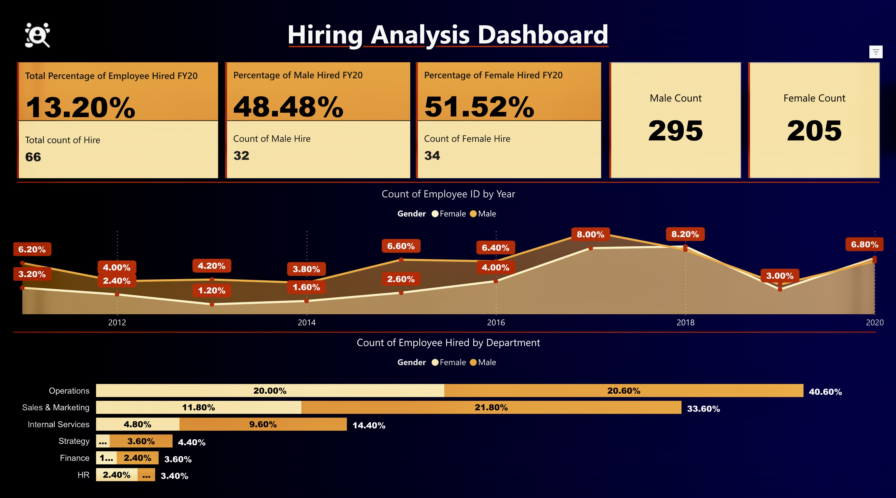
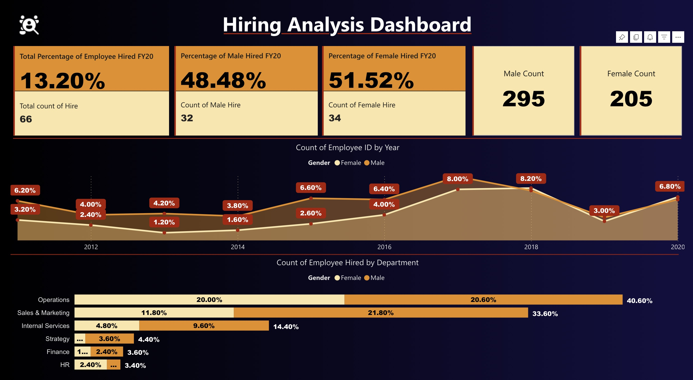
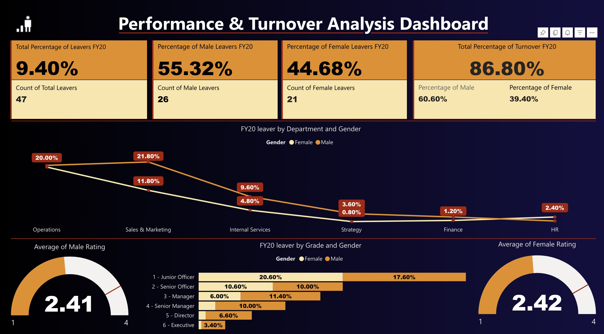

<div align="center">

# 📊 Diversity & Inclusion Dashboard

### Power BI | HR Analytics | Data Visualization | DAX | Power Query


### 📈 Interactive HR Analytics Dashboard built using Microsoft Power BI

<br>

## 🚀 Live Dashboard

### 👉 **[View Interactive Dashboard](https://app.powerbi.com/view?r=eyJrIjoiNjM0ZTAxYTctZDhkZS00OWI0LWE2YWYtMWVkYjQ2M2Q0ZWNlIiwidCI6ImUxNGU3M2ViLTUyNTEtNDM4OC04ZDY3LThmOWYyZTJkNWE0NiIsImMiOjEwfQ%3D%3D)**

</div>

---

# 📸 Dashboard Preview

> Replace the image paths with your screenshots after uploading them.

<p align="center">



</p>

---

# 📖 Project Overview

This project analyzes workforce diversity and inclusion using interactive Power BI visualizations.

The dashboard enables HR professionals and business leaders to monitor workforce composition, hiring trends, gender diversity, promotions, and employee demographics through interactive reports.

---

# 🎯 Business Problem

Organizations require data-driven insights to create a more inclusive workplace.

This dashboard helps decision-makers understand:

- Workforce diversity
- Gender representation
- Promotion trends
- Hiring patterns
- Department distribution
- Employee demographics

---

# ✨ Dashboard Features

✅ Executive KPI Cards

✅ Interactive Filters

✅ Dynamic Charts

✅ Drill Through Analysis

✅ Custom Tooltips

✅ Bookmarks

✅ Responsive Layout

✅ Department Analysis

✅ Gender Diversity

✅ Hiring Trend Analysis

✅ Promotion Analysis

✅ Employee Distribution

---

# 📊 KPIs Included

| KPI | Description |
|------|-------------|
| 👨‍💼 Total Employees | Overall workforce |
| 👩 Female Employees | Female workforce |
| 👨 Male Employees | Male workforce |
| 📈 Hiring Rate | Recruitment trend |
| 🚀 Promotion Rate | Promotion analysis |
| 💰 Average Salary | Salary insights |
| 🎂 Average Age | Workforce age |
| 🏢 Departments | Department distribution |

---

# 📈 Dashboard Pages

## 👩 Diversity Analysis

- Male vs Female
- Gender by Department
- Diversity Score
- Representation

---

## 📊 Employee Analytics

- Department-wise Employees
- Age Groups
- Education
- Experience

---

## 📈 Promotion Analysis

- Promotions
- Promotion Rate
- Gender Comparison
- Department Comparison

---

# 🎛 Interactive Features

- 🔍 Search
- 📅 Year Filter
- 🏢 Department Filter
- 👨 Gender Filter
- 🎓 Education Filter
- 📍 Location Filter
- 📈 Drill Through
- 🎯 Dynamic Titles
- 📌 Bookmarks
- 💡 Tooltips

---

# 🛠 Tech Stack

| Tool | Usage |
|------|-------|
| Power BI | Dashboard Development |
| Power Query | Data Cleaning |
| DAX | KPI Calculations |
| Excel | Data Source |
| Data Modeling | Relationships |

---

# 📂 Repository Structure

```
Diversity-and-Inclusion-Dashboard
│
├── README.md
├── LICENSE
├── Diversity_and_Inclusion_Dashboard.pbix
│
├── Images
│   ├── diversity-analysis.png
│   ├── employee-analysis.png
│   ├── promotion-analysis.png
│   
│
├── Dataset
│   └── HR_Data.xlsx
│
└── Documentation
    └── Dashboard.pdf
```

---

# 📷 Dashboard Gallery

## Diversity Analysis


---

## Employee Analytics



---

## Performance Dashboard



---

# 📌 Key Insights

✔ Workforce diversity trends

✔ Gender representation across departments

✔ Hiring and promotion trends

✔ Employee demographics

✔ Department performance

✔ HR decision support

---

# 📈 Future Improvements

- AI Insights
- Predictive Analytics
- Attrition Prediction
- RLS (Row-Level Security)
- Mobile Layout
- Power BI Service Refresh
- Advanced DAX Measures

---

# ⭐ Skills Demonstrated

- Data Cleaning
- Data Transformation
- Data Modeling
- DAX
- Power Query
- Data Visualization
- Dashboard Design
- Business Intelligence
- KPI Reporting
- Storytelling with Data

---

# 💼 Connect With Me

### 👤 Udayveer Singh Chaudhary

📧 udaychaudhary0029@gmail.com

💼 LinkedIn: [https://linkedin.com/in/your-profile](https://www.linkedin.com/in/udayveer-singh-chaudhary-a706b928a/)

🐙 GitHub: https://github.com/Uday029

---

<div align="center">

## ⭐ If you like this project, don't forget to Star the repository!

Made with ❤️ using Power BI

</div>
